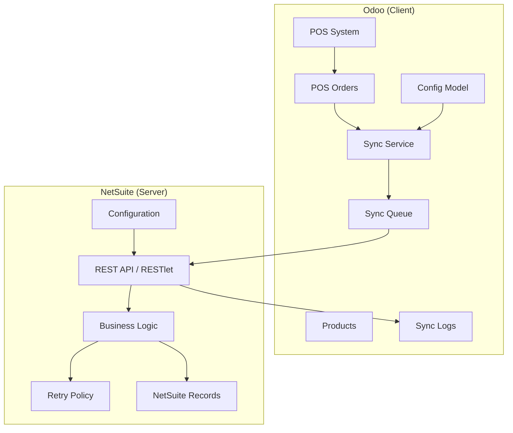
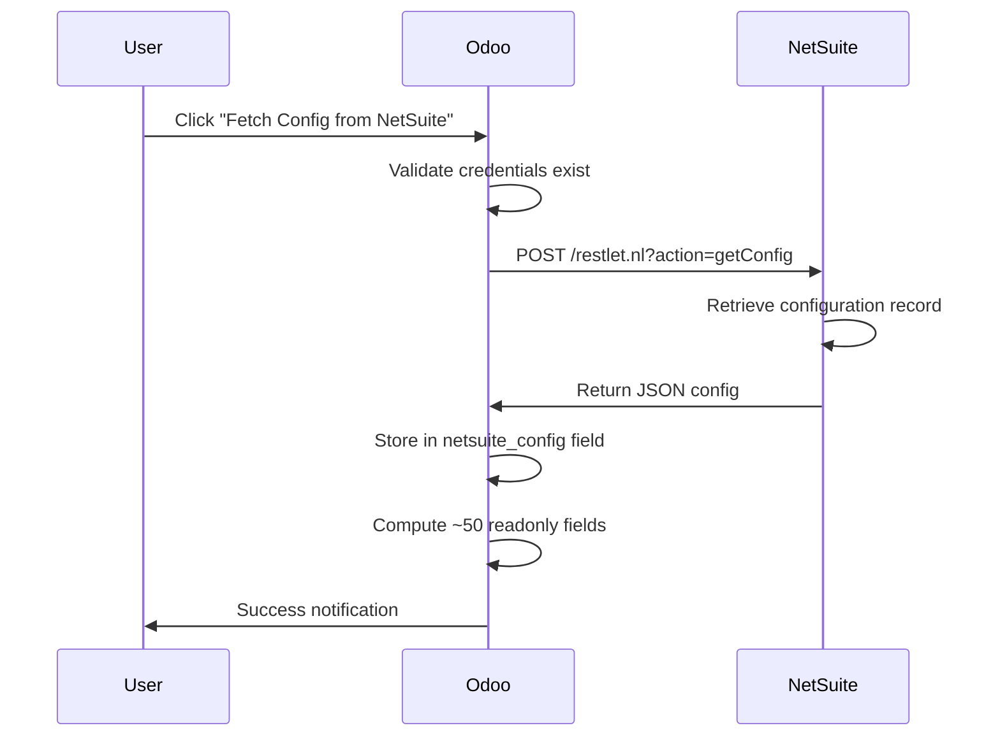
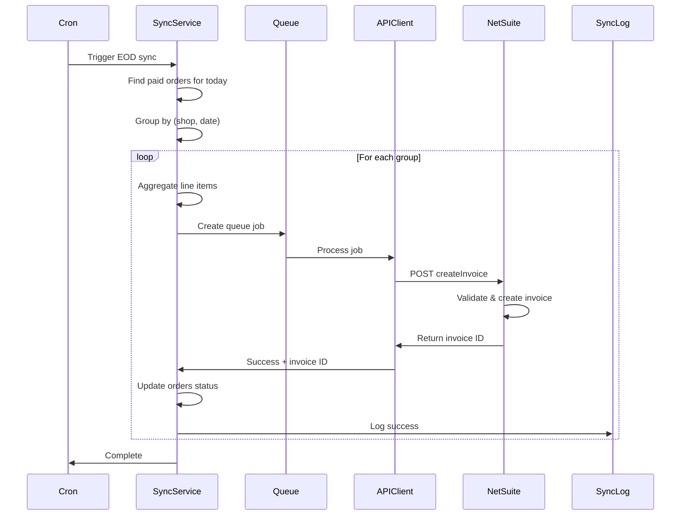
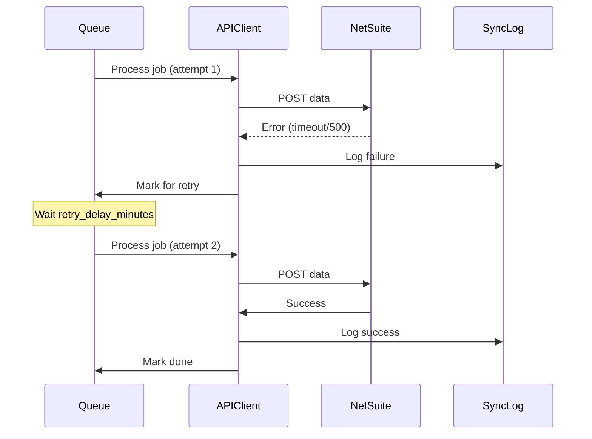

# NetSuite Integration Architecture

**Last Updated**: May 20, 2026  
**Module Version**: 17.0.1.0.0

---

## Table of Contents

1. [Architecture Overview](#architecture-overview)
2. [Design Principles](#design-principles)
3. [Component Responsibilities](#component-responsibilities)
4. [Sync Patterns](#sync-patterns)
5. [API Communication Flow](#api-communication-flow)
6. [Data Models](#data-models)
7. [Configuration Management](#configuration-management)
8. [Error Handling & Retry Logic](#error-handling--retry-logic)
9. [Architecture Benefits](#architecture-benefits)

---

## Architecture Overview

### High-Level Architecture

This integration implements a **Client-Server Pattern** where Odoo acts as a lightweight client and NetSuite serves as the intelligent server controlling all business logic.



### Key Architectural Decisions

| Decision | Rationale |
|----------|-----------|
| **NetSuite-Controlled Configuration** | Centralized control; changes don't require Odoo code deployment |
| **Consolidated Daily Invoicing** | Reduces API calls, simplifies NetSuite processing |
| **Queue-Based Processing** | Non-blocking UI, automatic retry capability |
| **Minimal Odoo Logic** | Easier maintenance, clear separation of concerns |

---

## Design Principles

### 1. Odoo as "Dumb Client"

**Philosophy**: Odoo should only **collect, store, and send** data—not make business decisions.

**Odoo Responsibilities:**
- ✅ Store NetSuite credentials securely
- ✅ Fetch configuration from NetSuite API
- ✅ Execute sync operations on schedule or manual trigger
- ✅ Send data to NetSuite via REST API
- ✅ Log responses for audit trail
- ✅ Display sync status in UI

**Odoo Does NOT:**
- ❌ Decide retry logic or frequency
- ❌ Implement business rules (e.g., when to consolidate)
- ❌ Store complex configuration locally
- ❌ Make sync decisions based on hardcoded logic

### 2. NetSuite as "Intelligent Server"

**Philosophy**: NetSuite controls **all business logic and configuration**.

**NetSuite Responsibilities:**
- ✅ Define retry policies (max attempts, delays)
- ✅ Configure email notifications
- ✅ Set batch processing rules
- ✅ Determine sync schedules
- ✅ Validate and process incoming data
- ✅ Apply business transformations
- ✅ Manage error handling and recovery

### 3. Separation of Concerns

| Layer | Responsibility | Technology |
|-------|----------------|------------|
| **Presentation** | UI views, menus, forms | Odoo XML Views |
| **Application** | Sync orchestration, queue management | Python (Odoo Models) |
| **Integration** | API client, HTTP communication | Python `requests` library |
| **Configuration** | Settings fetched from NetSuite | JSON stored in Odoo |
| **Audit** | Sync logs, status tracking | PostgreSQL (Odoo ORM) |

---

## Component Responsibilities

### Odoo Components

#### 1. Configuration Model (`netsuite.config`)

**Purpose**: Store credentials and display NetSuite-controlled configuration

**Fields:**
- **Stored Locally**:
  - `api_url` - NetSuite base URL
  - `account_id` - NetSuite account ID
  - `consumer_key`, `consumer_secret` - OAuth 1.0 credentials
  - `token_id`, `token_secret` - Access token credentials
  
- **Fetched from NetSuite** (read-only):
  - `netsuite_config` - Raw JSON from NetSuite
  - `last_config_fetch` - Last fetch timestamp
  - ~50 computed fields (integration mode, retry settings, etc.)

**Key Methods:**
- `fetch_netsuite_config()` - GET configuration from NetSuite API
- `test_connection()` - Verify API connectivity
- `get_active_config()` - Retrieve active configuration singleton

#### 2. Consolidated Sync Service (`netsuite.consolidated.sync`)

**Purpose**: Core business logic for syncing orders/invoices to NetSuite

**Key Features:**
- Consolidates multiple orders into one invoice per shop per day
- Aggregates line items by product (sums quantities)
- Groups orders by warehouse and date
- Handles both manual and scheduled sync

**Key Methods:**
- `sync_consolidated_orders()` - Main sync method
- `sync_consolidated_invoices()` - Invoice-specific sync
- `_prepare_consolidated_payload()` - Build NetSuite payload
- `_aggregate_order_lines()` - Combine line items by product

#### 3. Product Sync Service (`netsuite.product.sync`)

**Purpose**: Sync products/items from NetSuite to Odoo

**Key Features:**
- Fetches products from NetSuite hourly
- Creates/updates Odoo product records
- Maps NetSuite ID to Odoo product
- Tracks sync status per product

**Key Methods:**
- `sync_products_from_netsuite()` - Main product sync
- `_create_or_update_product()` - Upsert logic
- `_map_netsuite_fields()` - Field mapping

#### 4. Sync Queue Model (`netsuite.sync.queue`)

**Purpose**: Queue-based background job processing

**States:**
- `draft` - Job created, not yet queued
- `pending` - Queued for processing
- `processing` - Currently being processed
- `done` - Successfully completed
- `failed` - Failed after all retries

**Key Fields:**
- `model_name` - Odoo model (e.g., `pos.order`)
- `record_ids` - IDs to process
- `operation` - Operation type (sync_order, sync_product, etc.)
- `retry_count` - Number of retry attempts
- `next_retry` - Next retry timestamp
- `error_message` - Last error details

#### 5. Sync Log Model (`netsuite.sync.log`)

**Purpose**: Comprehensive audit trail of all sync attempts

**Key Fields:**
- `reference` - Order/invoice reference
- `status` - `success` / `failed` / `pending`
- `operation` - Operation type
- `request_payload` - Sent data (if logging enabled)
- `response_payload` - NetSuite response (if logging enabled)
- `execution_time_ms` - Performance metric
- `error_details` - Error message stack trace

#### 6. API Client (`netsuite.api.client`)

**Purpose**: HTTP communication layer with NetSuite

**Key Methods:**
- `make_request(action, payload)` - Generic API caller
- `get_config()` - Fetch configuration from NetSuite
- `create_invoice(payload)` - Send consolidated invoice
- `sync_items(payload)` - Send products/items
- `_build_headers()` - OAuth 1.0 authentication headers
- `_handle_response()` - Parse and validate responses

### NetSuite Components (Server-Side)

#### 1. RESTlet Endpoints

**Configuration Endpoint:**
- **Action**: `getConfig`
- **Method**: POST
- **Returns**: JSON configuration object with all settings

**Invoice Sync Endpoint:**
- **Action**: `createInvoice`
- **Method**: POST
- **Payload**: Consolidated invoice with aggregated line items
- **Returns**: Success/failure + NetSuite invoice ID

**Product Sync Endpoint:**
- **Action**: `syncItems`
- **Method**: POST
- **Payload**: Products to sync to Odoo
- **Returns**: Array of products with NetSuite IDs

#### 2. Configuration Record (SuiteScript)

Stores all business logic settings:
- Retry policies
- Email notification rules
- Batch sizes
- Sync schedules
- Timeout values
- Debug flags

#### 3. Business Logic (SuiteScript)

- Validates incoming data
- Applies data transformations
- Creates NetSuite records (Invoices, Sales Orders)
- Handles errors and sends notifications
- Implements retry logic server-side

---

## Sync Patterns

### 1. Hourly Product Sync

**Trigger:** Cron job (every hour) or manual button  
**Direction:** NetSuite → Odoo  
**Purpose:** Keep product catalog synchronized

**Flow:**
```
1. Odoo: Fetch config to check if hourly_sync_enabled
2. Odoo: Call NetSuite API (action=syncItems)
3. NetSuite: Return array of products
4. Odoo: For each product:
   - Search by NetSuite ID
   - Create if not exists, Update if exists
   - Update sync status field
5. Odoo: Log sync results
```

**Cron Configuration:**
- **Name**: `NetSuite: Fetch Products Hourly`
- **Interval**: 1 hour
- **User**: System/Admin
- **Model**: `netsuite.product.sync`
- **Method**: `sync_products_from_netsuite`

### 2. End-of-Day Consolidated Invoice Sync

**Trigger:** Cron job (daily at 23:59) or manual button  
**Direction:** Odoo → NetSuite  
**Purpose:** Send ONE consolidated invoice per shop per day

**Flow:**
```
1. Odoo: Find all PAID orders for today (or target date)
2. Odoo: Group orders by (warehouse_id, date)
3. Odoo: For each group:
   a. Aggregate all line items by product_id
   b. Sum quantities per product
   c. Build consolidated invoice payload
4. Odoo: Send to NetSuite (action=createInvoice)
5. NetSuite: Create invoice record
6. NetSuite: Return invoice ID + success status
7. Odoo: Update all orders in group:
   - netsuite_sync_status = 'synced'
   - netsuite_invoice_ref = returned ID
8. Odoo: Create sync log record
```

**Consolidation Example:**
```
Input: 3 Orders from Shop A on May 20
- Order 1: Coffee x2, Pastry x1 (Paid: Cash 50 AED)
- Order 2: Coffee x1, Juice x2 (Paid: Card 40 AED)
- Order 3: Coffee x1, Sandwich x1 (Paid: Cash 30 AED + Card 20 AED - SPLIT)

Output: 2 Consolidated Invoices

Cash Invoice (Customer: Cash Customer):
- Coffee x2.6 (2 + 0.6 from split order)
- Pastry x1
- Sandwich x0.6 (60% of split order)

Card Invoice (Customer: Credit Customer):
- Coffee x1.4 (1 + 0.4 from split order)
- Juice x2
- Sandwich x0.4 (40% of split order)
```

**Note:** Split-payment orders are proportionally divided across payment method invoices.

**Cron Configuration:**
- **Name**: `NetSuite: End of Day Order Sync`
- **Interval**: Daily at 23:59
- **User**: System/Admin
- **Model**: `netsuite.consolidated.sync`
- **Method**: `sync_consolidated_orders`

### 3. Manual Batch Sync

**Trigger:** User selection + Action menu  
**Direction:** Odoo → NetSuite  
**Purpose:** Sync selected orders from previous dates on-demand

**Flow:**
```
1. User: Select multiple orders (checkboxes)
2. User: Action → "Sync Selected to NetSuite"
3. Odoo: Validate orders (must be from previous dates, must be paid)
4. Odoo: Group by (warehouse_id, date)
5. Odoo: For each group:
   - Create consolidated invoice payload
   - Send to NetSuite
   - Update orders status
6. Odoo: Show notification: "Synced X orders into Y invoices"
```

**Constraints:**
- ❌ Cannot sync orders from today (end-of-day cron handles this)
- ✅ Can sync orders from any previous date
- ✅ Can select orders from multiple dates (grouped separately)
- ✅ Can select orders from multiple shops (grouped separately)

---

## API Communication Flow

### Fetch Configuration Flow



### Consolidated Invoice Sync Flow



### Error & Retry Flow



---

## Data Models

### Odoo Data Model Diagram

```
netsuite.config (singleton)
├── api_url: CharField
├── account_id: CharField
├── consumer_key/secret: CharField
├── token_id/secret: CharField
├── netsuite_config: TextField (JSON)
└── [50+ computed fields from JSON]

netsuite.subsidiary.mapping
├── warehouse_id: Many2one(stock.warehouse)
├── netsuite_subsidiary_id: CharField
└── netsuite_subsidiary_name: CharField

product.template (extended)
├── netsuite_id: CharField
├── netsuite_sync_status: Selection
└── netsuite_last_sync: Datetime

pos.order (extended)
├── netsuite_sync_status: Selection
├── netsuite_invoice_ref: CharField
├── netsuite_last_sync: Datetime
└── netsuite_error_message: Text

netsuite.sync.queue
├── model_name: CharField
├── record_ids: TextField (JSON array)
├── operation: Selection
├── state: Selection
├── retry_count: Integer
├── next_retry: Datetime
└── error_message: Text

netsuite.sync.log
├── reference: CharField
├── operation: Selection
├── status: Selection
├── request_payload: TextField
├── response_payload: TextField
├── execution_time_ms: Integer
└── error_details: Text
```

### NetSuite Configuration Schema

**Fetched from NetSuite** via `getConfig` action:

```json
{
  "integration_mode": "scheduled",
  "consolidate_orders": true,
  "consolidate_invoices": true,
  
  "hourly_sync_enabled": true,
  "end_of_day_sync_time": "23:59",
  
  "retry_enabled": true,
  "max_retries": 3,
  "retry_delay_minutes": 5,
  
  "send_email_on_success": false,
  "send_email_on_failure": true,
  "notification_recipients": "admin@example.com,manager@example.com",
  
  "batch_size": 100,
  "timeout_seconds": 30,
  
  "debug_logging": true,
  "log_request_payload": true,
  "log_response_payload": true
}
```

All these fields become **read-only computed fields** in Odoo config model.

---

## Configuration Management

### Configuration Lifecycle

```
1. Admin creates config record in Odoo
2. Admin fills credentials (API URL, Account ID, OAuth keys)
3. Admin clicks "Fetch Config from NetSuite"
4. Odoo calls NetSuite API (getConfig)
5. NetSuite returns JSON configuration
6. Odoo stores JSON in netsuite_config field
7. Odoo computes 50+ readonly fields from JSON
8. Configuration used by sync services
```

### Configuration Update Flow

**When NetSuite configuration changes:**

```
1. NetSuite admin updates config record in NetSuite
2. Odoo admin clicks "Fetch Config from NetSuite" button
3. New configuration automatically applied
4. No code deployment needed
5. Next sync uses new settings
```

**Optional:** Can schedule auto-fetch (e.g., daily) via cron job

### Local vs. Remote Configuration

| Setting | Stored In | Why |
|---------|-----------|-----|
| **API URL** | Odoo | Environment-specific (dev/prod) |
| **Credentials** | Odoo | Security (encrypted in DB) |
| **Retry Logic** | NetSuite | Business rule, changes frequently |
| **Sync Schedules** | NetSuite | Business decision |
| **Email Recipients** | NetSuite | Business users, changes often |
| **Batch Sizes** | NetSuite | Performance tuning |
| **Debug Flags** | NetSuite | Troubleshooting control |

---

## Error Handling & Retry Logic

### Retry Strategy

**Controlled by NetSuite Configuration:**
- `retry_enabled`: Whether retries are enabled
- `max_retries`: Maximum number of retry attempts (default: 3)
- `retry_delay_minutes`: Minutes between retries (default: 5)

**Odoo Implementation:**

```python
def process_queue_job(job):
    try:
        response = api_client.make_request(job.operation, job.payload)
        job.state = 'done'
        log_success(response)
    except Exception as e:
        job.retry_count += 1
        
        if job.retry_count < config.max_retries:
            job.state = 'pending'
            job.next_retry = now + timedelta(minutes=config.retry_delay_minutes)
            job.error_message = str(e)
        else:
            job.state = 'failed'
            send_failure_notification(job)
```

### Error Categories

| Error Type | Handling Strategy |
|------------|-------------------|
| **Network Timeout** | Retry with exponential backoff |
| **5xx Server Error** | Retry immediately, then backoff |
| **4xx Client Error** | Do not retry, log error, notify admin |
| **Invalid Data** | Do not retry, mark failed, notify |
| **Authentication Error** | Do not retry, halt all syncs, critical alert |

### Email Notifications

**Configured in NetSuite:**
- `send_email_on_success`: Send success emails (default: false)
- `send_email_on_failure`: Send failure emails (default: true)
- `notification_recipients`: Comma-separated email list

**Odoo checks these flags before sending emails.**

---

## Architecture Benefits

### ✅ Maintainability

- **Simple Odoo Code**: Minimal business logic, easier debugging
- **Centralized Configuration**: One place to change behavior
- **Clear Responsibilities**: Each component has one job

### ✅ Flexibility

- **Dynamic Configuration**: Change retry policies without code deployment
- **Multiple Sync Modes**: Real-time, scheduled, manual
- **Extensible**: Easy to add new sync operations

### ✅ Scalability

- **Consolidated Invoicing**: Reduces API calls by 100x+
- **Queue-Based Processing**: Non-blocking, handles high volume
- **Batch Processing**: Configurable batch sizes

### ✅ Reliability

- **Automatic Retries**: Handles transient failures
- **Comprehensive Logging**: Full audit trail
- **Error Notifications**: Proactive alerting
- **Queue Recovery**: Failed jobs can be manually retried

### ✅ Testability

- **Isolated Components**: Unit testable services
- **Configuration Overrides**: Easy test scenarios
- **Modular Design**: Each component independently testable

---

## Next Steps

- **Implementation Details**: See [TECHNICAL_DOCUMENTATION.md](TECHNICAL_DOCUMENTATION.md)
- **Setup Guide**: See [QUICK_START.md](QUICK_START.md)
- **Code Examples**: See `Implementation/` folder
