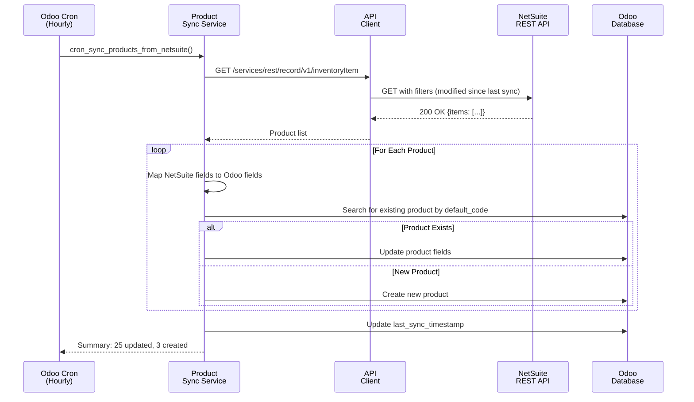
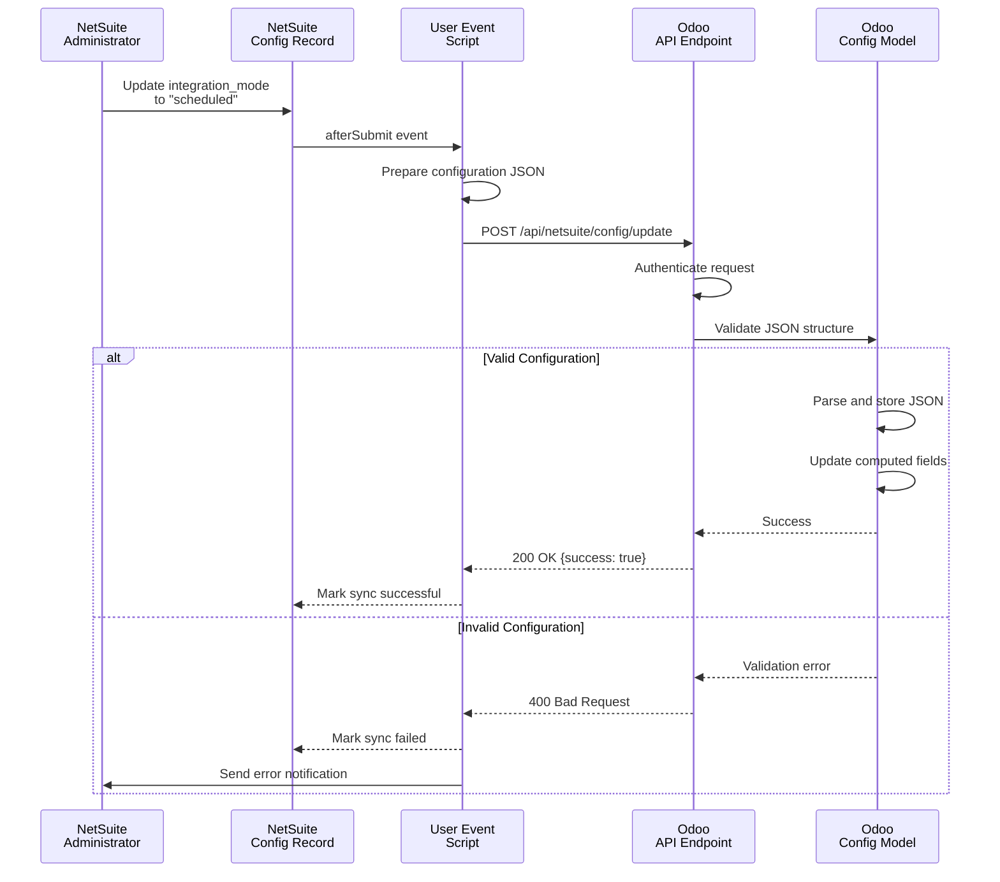
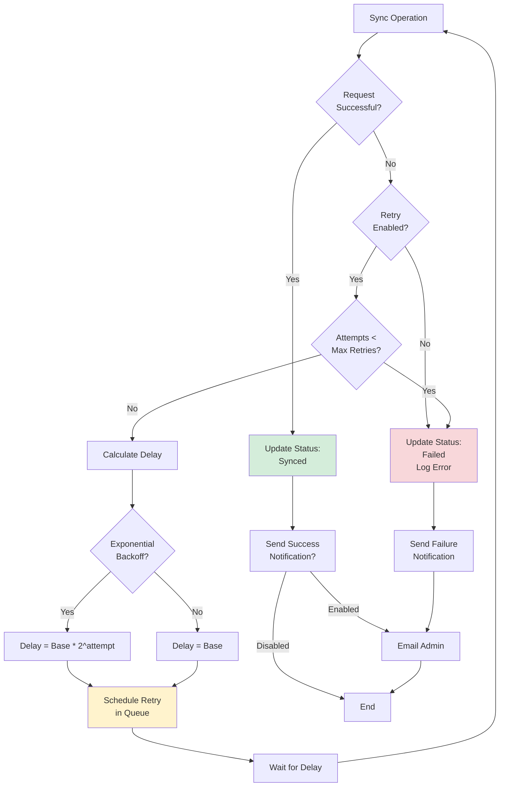

# Technical Documentation
## Odoo POS ↔ Oracle NetSuite Integration

---

**Project Name**: Odoo Point of Sale to NetSuite ERP Integration  
**Version**: 2.0  
**Date**: May 13, 2026  
**Document Status**: Phase 1 Implementation Complete  
**Classification**: Technical Implementation Specification

---

## Document Control

| Version | Date | Author | Description |
|---------|------|--------|-------------|
| 1.0 | May 2026 | Development Team | Initial Release |
| 2.0 | May 13, 2026 | Development Team | Post-Implementation Documentation |

## Document Purpose

This technical documentation provides comprehensive implementation details for the Odoo POS to NetSuite ERP integration solution. It serves as the authoritative reference for developers, system administrators, and technical stakeholders involved in deployment, maintenance, and enhancement of the integration system.

---

## Table of Contents

1. [Executive Summary](#1-executive-summary)
2. [System Architecture](#2-system-architecture)
3. [Odoo Implementation Details](#3-odoo-implementation-details)
4. [NetSuite Implementation Details](#4-netsuite-implementation-details)
5. [API Specifications](#5-api-specifications)
6. [Data Flow and Process Logic](#6-data-flow-and-process-logic)
7. [Configuration Management](#7-configuration-management)
8. [Security and Authentication](#8-security-and-authentication)
9. [Error Handling and Logging](#9-error-handling-and-logging)
10. [Deployment Guide](#10-deployment-guide)
11. [Testing Strategy](#11-testing-strategy)
12. [Appendices](#12-appendices)

---

## 1. Executive Summary

### 1.1 Project Overview

The Odoo POS ↔ NetSuite Integration project establishes a bidirectional, configurable enterprise integration solution between Odoo Point of Sale (POS) system and Oracle NetSuite ERP platform. This integration enables automated synchronization of transactional and master data while supporting multiple execution modes to accommodate diverse business requirements.

### 1.2 Business Objectives

- **Operational Efficiency**: Eliminate manual data entry and reduce operational overhead
- **Data Consistency**: Maintain synchronized master data across both systems
- **Financial Accuracy**: Ensure accurate and timely financial reporting through consolidated invoicing
- **Scalability**: Support multi-location, multi-subsidiary business operations
- **Flexibility**: Enable dynamic configuration changes without code deployment

### 1.3 Key Features Delivered

✅ **Dynamic Configuration Management**
- NetSuite-controlled business logic via REST API
- Real-time configuration updates to Odoo
- No hardcoded business rules

✅ **Consolidated Transaction Processing**
- One consolidated invoice per shop per day
- Aggregated line items with intelligent quantity summation
- Automatic end-of-day processing

✅ **Flexible Execution Modes**
- Real-time sync on transaction confirmation
- Scheduled batch processing (midnight sync)
- Manual on-demand synchronization

✅ **Master Data Synchronization**
- Hourly product/item catalog updates
- Payment method mappings
- Multi-subsidiary support (NetSuite OneWorld)

✅ **Enterprise-Grade Reliability**
- Exponential backoff retry mechanism
- Comprehensive audit logging
- Manual retry capabilities for failed transactions
- Queue-based background processing

### 1.4 Integration Scope

#### Master Data (NetSuite → Odoo)
- ✅ Products/Items (Inventory Items)
- ✅ Payment Methods
- ✅ Shop/Subsidiary Mappings
- ✅ Location and Department Hierarchies

#### Transactional Data (Odoo → NetSuite)
- ✅ Consolidated Sales Orders (one per shop per day)
- ✅ Consolidated Invoices (one per shop per day)
- ✅ Aggregated Payment Transactions

### 1.5 Technical Architecture Summary

The solution implements a **Client-Server Architecture Pattern** where:

- **Odoo (Client)**: "Dumb client" that stores only NetSuite credentials and executes synchronization tasks
- **NetSuite (Server)**: "Intelligent server" that controls all business logic, retry policies, and configuration
- **Communication**: RESTful API with OAuth 1.0 authentication

This design ensures:
- Centralized business rule management
- Simplified Odoo module maintenance
- Dynamic reconfiguration without code changes
- Clear separation of concerns

---

## 2. System Architecture

### 2.1 High-Level Architecture

```
┌─────────────────────────────────────────────────────────────────────┐
│                         ODOO POS SYSTEM                             │
│  ┌────────────────┐    ┌──────────────────┐    ┌────────────────┐ │
│  │  POS Frontend  │───▶│  POS Order Model │───▶│ NetSuite Module│ │
│  │   (UI Layer)   │    │   (Business)     │    │  (Integration) │ │
│  └────────────────┘    └──────────────────┘    └────────┬───────┘ │
│                                                           │         │
│  ┌────────────────┐    ┌──────────────────┐    ┌────────▼───────┐ │
│  │  Configuration │    │  Sync Logging    │    │  API Client    │ │
│  │     Model      │    │     Model        │    │    Service     │ │
│  └────────────────┘    └──────────────────┘    └────────┬───────┘ │
└─────────────────────────────────────────────────────────┼─────────┘
                                                           │
                                          HTTPS / OAuth 1.0
                                                           │
┌─────────────────────────────────────────────────────────▼─────────┐
│                      ORACLE NETSUITE ERP                           │
│  ┌────────────────┐    ┌──────────────────┐    ┌────────────────┐│
│  │   RESTlet      │    │  Business Logic  │    │  Configuration │││
│  │   Endpoints    │───▶│     Scripts      │───▶│     Records    │││
│  └────────────────┘    └──────────────────┘    └────────────────┘││
│                                                                     │
│  [TO BE IMPLEMENTED - NetSuite Components]                         │
│                                                                     │
└─────────────────────────────────────────────────────────────────────┘
```

### 2.2 Component Architecture

#### 2.2.1 Odoo Components

| Component | Type | Responsibility |
|-----------|------|----------------|
| `netsuite.config` | Model | Credential storage and configuration management |
| `pos.order` (extended) | Model | POS order sync status and NetSuite reference tracking |
| `netsuite.api.client` | Service | HTTP communication with NetSuite REST APIs |
| `netsuite.consolidated.sync` | Service | Consolidated order/invoice aggregation logic |
| `netsuite.sync.log` | Model | Audit trail and sync attempt logging |
| `netsuite.sync.queue` | Model | Background job queue management |
| `netsuite.subsidiary.mapping` | Model | Shop to NetSuite subsidiary mapping |
| `netsuite.payment.method.mapping` | Model | Payment method mapping |
| Cron Jobs | Scheduler | Automated hourly and end-of-day sync |

#### 2.2.2 NetSuite Components

**[TO BE DOCUMENTED - NetSuite Team to Complete]**

Expected Components:
- Custom Configuration Record
- User Event Scripts
- Scheduled Scripts
- RESTlet Endpoints
- Saved Searches
- Error Notification Framework

### 2.3 Technology Stack

#### Odoo Platform
- **Platform**: Odoo 17.0 Community/Enterprise
- **Language**: Python 3.10+
- **Framework**: Odoo ORM
- **Database**: PostgreSQL 14+
- **API**: Odoo XML-RPC / JSON-RPC
- **HTTP Library**: Python `requests` library

#### NetSuite Platform
**[TO BE DOCUMENTED - NetSuite Team]**

#### Infrastructure
- **Containerization**: Docker & Docker Compose
- **Development Server**: Mock NetSuite RESTlet (Node.js/Express)
- **Version Control**: Git / GitHub
- **Deployment**: SDF (SuiteCloud Development Framework) for NetSuite

---

## 3. Odoo Implementation Details

### 3.1 Module Structure

```
addons/netsuite_pos_integration/
├── __init__.py
├── __manifest__.py
├── README.md
│
├── controllers/
│   ├── __init__.py
│   └── netsuite_config_controller.py      # API endpoints for config updates
│
├── data/
│   ├── netsuite_cron_data.xml             # Scheduled jobs
│   └── netsuite_sync_status_data.xml      # Initial data
│
├── models/
│   ├── __init__.py
│   ├── netsuite_config.py                 # Configuration model
│   ├── netsuite_api_client.py             # API client service
│   ├── netsuite_consolidated_sync.py      # Consolidation service
│   ├── netsuite_mappings.py               # Mapping models
│   ├── netsuite_product_sync.py           # Product sync service
│   ├── netsuite_sync_log.py               # Logging model
│   ├── netsuite_sync_queue.py             # Queue model
│   ├── pos_order.py                       # POS order extension
│   └── res_partner.py                     # Customer extension (future)
│
├── security/
│   ├── ir.model.access.csv                # Access control
│   └── netsuite_security.xml              # Security groups
│
├── views/
│   ├── netsuite_config_views.xml          # Configuration UI
│   ├── netsuite_mapping_views.xml         # Mapping UI
│   ├── netsuite_menu.xml                  # Menu structure
│   ├── netsuite_sync_log_views.xml        # Logs UI
│   ├── netsuite_sync_queue_views.xml      # Queue UI
│   ├── pos_order_views.xml                # Extended POS views
│   └── product_views.xml                  # Product views
│
└── wizards/
    ├── __init__.py
    └── netsuite_manual_sync_wizard.py     # Manual sync wizard
```

### 3.2 Core Models

#### 3.2.1 NetSuite Configuration Model

**Model Name**: `netsuite.config`  
**Purpose**: Central configuration management and credential storage

**Key Fields**:

| Field Name | Type | Required | Description |
|------------|------|----------|-------------|
| `name` | Char | Yes | Configuration name |
| `active` | Boolean | Yes | Enable/disable configuration |
| `api_url` | Char | Yes | NetSuite base API URL |
| `account_id` | Char | Yes | NetSuite account identifier |
| `consumer_key` | Char | No | OAuth consumer key |
| `consumer_secret` | Char | No | OAuth consumer secret |
| `token_id` | Char | No | OAuth token ID |
| `token_secret` | Char | No | OAuth token secret |
| `netsuite_config` | Text | No | Configuration JSON from NetSuite (read-only) |
| `last_config_fetch` | Datetime | No | Last configuration fetch timestamp |

**Computed Fields** (from NetSuite configuration JSON):

| Field | Source Path | Description |
|-------|-------------|-------------|
| `config_integration_mode` | `configuration.integration_mode` | Current sync mode |
| `config_retry_enabled` | `configuration.retry_policy.enabled` | Retry enabled flag |
| `config_max_retries` | `configuration.retry_policy.max_retries` | Maximum retry attempts |
| `config_consolidate_orders` | `configuration.consolidation_rules.consolidate_orders_per_shop_per_day` | Consolidation flag |
| `config_end_of_day_sync_time` | `configuration.scheduled_settings.order_sync_time` | EOD sync time |

**Key Methods**:

```python
@api.model
def get_active_config():
    """Retrieve the active configuration"""
    
def fetch_config_from_netsuite(self):
    """Fetch configuration JSON from NetSuite API"""
    
def test_connection(self):
    """Test NetSuite API connectivity"""
    
def action_sync_products(self):
    """Manually trigger product sync"""
```

#### 3.2.2 POS Order Extension

**Model Name**: `pos.order` (inherited)  
**Purpose**: Track NetSuite sync status for POS orders

**Additional Fields**:

| Field Name | Type | Description |
|------------|------|-------------|
| `netsuite_sync_status` | Selection | Sync status (not_synced, queued, synced, failed) |
| `netsuite_id` | Char | NetSuite internal ID |
| `netsuite_tran_id` | Char | NetSuite transaction number |
| `netsuite_sync_date` | Datetime | Last successful sync timestamp |
| `netsuite_error` | Text | Error message from last failed sync |
| `netsuite_sync_count` | Integer | Number of sync attempts |
| `x_netsuite_invoice_id` | Char | Consolidated invoice NetSuite ID |
| `x_netsuite_invoice_sync_date` | Datetime | Invoice sync timestamp |

**Key Methods**:

```python
def action_sync_to_netsuite(self):
    """
    Manual batch sync to NetSuite
    Creates ONE consolidated invoice per shop per day
    """
    
def _prepare_netsuite_order_data(self):
    """Prepare order data for NetSuite API"""
    
def _mark_as_synced(self, netsuite_id, netsuite_tran_id):
    """Update sync status after successful sync"""
    
def _mark_as_failed(self, error_message):
    """Update sync status after failed sync"""
```

#### 3.2.3 Consolidated Sync Service

**Model Name**: `netsuite.consolidated.sync`  
**Type**: Abstract Model (Service)  
**Purpose**: Aggregate and sync consolidated orders/invoices

**Key Methods**:

```python
@api.model
def sync_consolidated_orders(self, target_date=None, warehouse_ids=None):
    """
    Sync consolidated orders to NetSuite (one per shop per day)
    
    Args:
        target_date: Date to sync (default: yesterday)
        warehouse_ids: List of warehouse IDs (default: all)
        
    Returns:
        dict: {success, total_shops, total_orders, synced, failed, errors}
    """
    
@api.model
def sync_consolidated_invoices(self, target_date=None, warehouse_ids=None):
    """Sync consolidated invoices to NetSuite"""
    
def _group_orders_by_shop(self, pos_orders):
    """Group orders by warehouse/shop"""
    
def _aggregate_line_items(self, orders):
    """
    Aggregate order lines by product
    Sums quantities, calculates weighted average prices
    """
    
def _prepare_consolidated_payload(self, warehouse, orders, aggregated_lines, target_date):
    """Prepare consolidated invoice payload for NetSuite API"""
```

**Consolidation Logic**:

```python
# Aggregation Example
for order in shop_orders:
    for line in order.lines:
        key = (line.product_id.id, line.price_unit, line.discount)
        if key in line_aggregation:
            line_aggregation[key]['qty'] += line.qty
            line_aggregation[key]['total_amount'] += line.price_subtotal_incl
        else:
            line_aggregation[key] = {
                'product_id': line.product_id,
                'qty': line.qty,
                'price_unit': line.price_unit,
                'discount': line.discount,
                'total_amount': line.price_subtotal_incl
            }
```

#### 3.2.4 API Client Service

**Model Name**: `netsuite.api.client`  
**Type**: Abstract Model (Service)  
**Purpose**: Handle all HTTP communication with NetSuite

**Key Methods**:

```python
@api.model
def _get_headers(self, config):
    """Generate HTTP headers with OAuth signature"""
    
@api.model
def _make_request(self, config, endpoint, method='POST', data=None):
    """
    Make HTTP request to NetSuite
    
    Returns:
        tuple: (success, response_data, error_message, status_code, execution_time)
    """
    
@api.model
def fetch_config(self, config):
    """Fetch configuration from NetSuite"""
    
@api.model
def test_connection(self, config):
    """Test NetSuite connectivity"""
    
@api.model
def sync_product(self, config, product_data):
    """Sync individual product to NetSuite"""
    
@api.model
def create_consolidated_order(self, config, order_payload):
    """Create consolidated order in NetSuite"""
    
@api.model
def create_consolidated_invoice(self, config, invoice_payload):
    """Create consolidated invoice in NetSuite"""
```

**Request Flow**:

1. Retrieve active configuration
2. Generate OAuth headers (if credentials configured)
3. Construct full URL from base URL + endpoint
4. Execute HTTP request with timeout settings
5. Parse JSON response
6. Log request/response for audit
7. Return standardized response tuple

#### 3.2.5 Sync Logging Model

**Model Name**: `netsuite.sync.log`  
**Purpose**: Comprehensive audit trail for all sync operations

**Fields**:

| Field | Type | Description |
|-------|------|-------------|
| `name` | Char | Log entry identifier |
| `sync_type` | Selection | Type: order, invoice, product, config |
| `sync_direction` | Selection | Direction: odoo_to_netsuite, netsuite_to_odoo |
| `status` | Selection | Status: success, failed, pending |
| `request_payload` | Text | JSON request payload |
| `response_payload` | Text | JSON response payload |
| `error_message` | Text | Error details if failed |
| `execution_time_ms` | Integer | Request execution time |
| `http_status_code` | Integer | HTTP response status |
| `pos_order_ids` | Many2many | Related POS orders |
| `sync_date` | Datetime | Sync attempt timestamp |
| `retry_count` | Integer | Number of retries |

### 3.3 Mapping Models

#### 3.3.1 Subsidiary Mapping

**Model Name**: `netsuite.subsidiary.mapping`  
**Purpose**: Map Odoo shops/warehouses to NetSuite subsidiaries

**Fields**:

| Field | Type | Description |
|-------|------|-------------|
| `name` | Char | Mapping name |
| `odoo_warehouse_id` | Many2one | Odoo warehouse/shop |
| `netsuite_subsidiary_id` | Char | NetSuite subsidiary internal ID |
| `netsuite_subsidiary_name` | Char | NetSuite subsidiary name |
| `netsuite_department_id` | Char | NetSuite department ID (optional) |
| `netsuite_location_id` | Char | NetSuite location ID (optional) |
| `active` | Boolean | Enable/disable mapping |

#### 3.3.2 Payment Method Mapping

**Model Name**: `netsuite.payment.method.mapping`  
**Purpose**: Map Odoo payment methods to NetSuite payment methods

**Fields**:

| Field | Type | Description |
|-------|------|-------------|
| `name` | Char | Mapping name |
| `odoo_payment_method_id` | Many2one | Odoo payment method |
| `netsuite_payment_method_id` | Char | NetSuite payment method ID |
| `netsuite_payment_method_name` | Char | NetSuite payment method name |
| `active` | Boolean | Enable/disable mapping |

### 3.4 Automated Schedulers (Cron Jobs)

#### 3.4.1 Hourly Product Sync

**Cron Name**: `NetSuite: Sync Products Hourly`  
**Schedule**: Every hour at :00  
**Model**: `netsuite.product.sync`  
**Method**: `cron_sync_products_from_netsuite`

**Logic**:
1. Fetch active NetSuite configuration
2. Call NetSuite REST API: `/services/rest/record/v1/inventoryItem`
3. Parse response and map fields to Odoo products
4. Create or update products in Odoo
5. Log sync results

**Field Mapping (NetSuite → Odoo)**:

| NetSuite Field | Odoo Field | Notes |
|----------------|------------|-------|
| `itemid` | `default_code` | Product internal reference |
| `displayname` | `name` | Product name |
| `salesdescription` | `description_sale` | Sales description |
| `cost` | `standard_price` | Product cost |
| `price` | `list_price` | Sale price |
| `quantityavailable` | `qty_available` | Stock quantity |
| `isinactive` | `active` | Active status (inverted) |

#### 3.4.2 End of Day Order Sync

**Cron Name**: `NetSuite: Sync Orders End of Day`  
**Schedule**: Daily at 00:00 (midnight)  
**Model**: `netsuite.consolidated.sync`  
**Method**: `cron_sync_end_of_day_orders`

**Logic**:
1. Calculate target date (previous day)
2. Fetch all paid POS orders from previous day
3. Group orders by warehouse/shop
4. For each shop:
   - Aggregate all order lines by product
   - Calculate total quantities and weighted average prices
   - Generate consolidated invoice payload
   - Send to NetSuite API
   - Mark orders as synced
5. Log all results

**Payload Structure**:

```json
{
  "type": "consolidated_invoice",
  "subsidiary_id": "123",
  "transaction_date": "2026-05-12",
  "shop_name": "Downtown Store",
  "total_orders": 45,
  "line_items": [
    {
      "item_id": "PROD-001",
      "quantity": 125,
      "rate": 19.99,
      "amount": 2498.75
    }
  ],
  "payments": [
    {
      "payment_method": "Credit Card",
      "amount": 15234.50
    }
  ]
}
```

### 3.5 Manual Sync Operations

#### 3.5.1 Batch Order Sync

**Location**: Point of Sale → Orders (list view)  
**Action**: "Sync to NetSuite" (multi-select action)

**Business Rules**:
- Cannot sync today's orders (must wait for EOD)
- Cannot sync already synced orders
- Groups orders by (shop, date) automatically
- Creates one consolidated invoice per group

**Wizard**: `netsuite.manual.sync.wizard`

#### 3.5.2 Configuration Fetch

**Location**: NetSuite → Configuration  
**Button**: "Fetch Config from NetSuite"

**Flow**:
1. Call NetSuite endpoint: `/app/site/hosting/restlet.nl?action=getConfig`
2. Receive configuration JSON
3. Parse and store in `netsuite_config` field
4. Update all computed fields
5. Display success message with key settings

#### 3.5.3 Test Connection

**Location**: NetSuite → Configuration  
**Button**: "Test Connection"

**Validates**:
- API URL reachability
- OAuth credentials (if configured)
- NetSuite account accessibility
- Configuration endpoint availability

### 3.6 User Interface

#### 3.6.1 Configuration Form View

```xml
<form string="NetSuite Configuration">
    <header>
        <button name="fetch_config_from_netsuite" string="Fetch Config from NetSuite" 
                type="object" class="oe_highlight"/>
        <button name="test_connection" string="Test Connection" 
                type="object"/>
        <button name="action_sync_products" string="Sync Products Now" 
                type="object"/>
    </header>
    <sheet>
        <group name="credentials">
            <group string="API Credentials">
                <field name="api_url"/>
                <field name="account_id"/>
                <field name="consumer_key" password="True"/>
                <field name="consumer_secret" password="True"/>
                <field name="token_id" password="True"/>
                <field name="token_secret" password="True"/>
            </group>
        </group>
        <group name="config_display" string="Configuration from NetSuite (Read-Only)">
            <field name="config_integration_mode"/>
            <field name="config_retry_enabled"/>
            <field name="config_max_retries"/>
            <field name="config_end_of_day_sync_time"/>
            <field name="last_config_fetch"/>
        </group>
        <notebook>
            <page string="Raw Configuration JSON">
                <field name="netsuite_config" widget="ace" 
                       options="{'mode': 'json'}" readonly="1"/>
            </page>
        </notebook>
    </sheet>
</form>
```

#### 3.6.2 POS Order List View Enhancement

Added columns:
- NetSuite Sync Status (badge: green/red/grey)
- NetSuite Transaction ID (link if synced)
- Last Sync Date
- Sync Error (if failed)

Added actions:
- Sync to NetSuite (batch action)
- Retry Failed Sync (for failed orders)

#### 3.6.3 Sync Log List View

Filterable by:
- Sync Type (order/invoice/product/config)
- Status (success/failed/pending)
- Date Range
- Related POS Orders

Searchable by:
- Error message
- NetSuite transaction ID
- Request/response payload

---

## 4. NetSuite Implementation Details

**[TO BE DOCUMENTED BY NETSUITE DEVELOPMENT TEAM]**

### 4.1 Custom Records

**Expected Custom Records**:

#### Integration Configuration Record
- Integration Mode
- Retry Policy Settings
- Scheduled Frequency
- Email Notification Recipients
- API Endpoint Whitelisting
- Active Status

### 4.2 SuiteScript Components

#### 4.2.1 User Event Scripts

**[PLACEHOLDER - Details to be added]**

Expected Scripts:
- Configuration Update Handler
- Invoice Validation Script
- Order Duplicate Prevention

#### 4.2.2 Scheduled Scripts

**[PLACEHOLDER - Details to be added]**

Expected Scripts:
- Scheduled Order Pull (if scheduled mode enabled)
- Data Cleanup Script
- Error Notification Dispatcher

#### 4.2.3 RESTlet Endpoints

**[PLACEHOLDER - Details to be added]**

Expected Endpoints:

| Endpoint | Method | Purpose |
|----------|--------|---------|
| `/getConfig` | GET | Return configuration JSON |
| `/receiveConsolidatedInvoice` | POST | Receive consolidated invoice from Odoo |
| `/receiveConsolidatedOrder` | POST | Receive consolidated order from Odoo |
| `/syncProducts` | GET | Return product catalog |
| `/syncPaymentMethods` | GET | Return payment methods |

### 4.3 Saved Searches

**[PLACEHOLDER - Details to be added]**

### 4.4 Error Handling Logic

**[PLACEHOLDER - Details to be added]**

---

## 5. API Specifications

### 5.1 Odoo REST API Endpoints

#### 5.1.1 Configuration Update Endpoint

**Endpoint**: `/api/netsuite/config/update`  
**Method**: POST  
**Authentication**: Odoo Database Authentication  
**Purpose**: Receive configuration updates from NetSuite

**Headers**:
```http
Content-Type: application/json
db: {database_name}
login: {user_login}
password: {user_password}
```

**Request Body**:
```json
{
  "configuration": {
    "integration_mode": "scheduled",
    "realtime_settings": {
      "enabled": false,
      "sync_on_order_confirmed": false
    },
    "scheduled_settings": {
      "enabled": true,
      "order_sync_time": "00:00",
      "invoice_sync_time": "00:00",
      "product_sync_frequency": "hourly",
      "product_sync_hour_interval": 1
    },
    "retry_policy": {
      "enabled": true,
      "max_retries": 3,
      "initial_delay_minutes": 5,
      "use_exponential_backoff": true,
      "backoff_multiplier": 2
    },
    "batch_processing": {
      "order_batch_size": 100,
      "invoice_batch_size": 100,
      "product_batch_size": 50
    },
    "notification": {
      "send_email_on_failure": true,
      "send_email_on_success": false,
      "notification_recipients": ["admin@example.com"]
    },
    "consolidation_rules": {
      "consolidate_orders_per_shop_per_day": true,
      "consolidate_invoices_per_shop_per_day": true,
      "aggregate_line_items": true,
      "group_by_product": true
    }
  },
  "metadata": {
    "config_version": "1.0",
    "last_updated_by": "NetSuite System",
    "last_updated_at": "2026-05-13T10:30:00Z",
    "netsuite_environment": "production"
  }
}
```

**Success Response**:
```json
{
  "success": true,
  "message": "Configuration updated successfully",
  "config_id": 1,
  "applied_at": "2026-05-13T10:30:15Z"
}
```

**Error Response**:
```json
{
  "success": false,
  "error": "Invalid configuration JSON structure",
  "details": "Missing required field: configuration.integration_mode"
}
```

### 5.2 NetSuite REST API Endpoints

**[TO BE DOCUMENTED BY NETSUITE TEAM]**

#### 5.2.1 Get Configuration

**Endpoint**: `[PLACEHOLDER]`  
**Method**: GET  
**Authentication**: OAuth 1.0

#### 5.2.2 Receive Consolidated Invoice

**Endpoint**: `[PLACEHOLDER]`  
**Method**: POST  
**Authentication**: OAuth 1.0

**Expected Request Payload** (from Odoo):
```json
{
  "type": "consolidated_invoice",
  "subsidiary_id": "123",
  "transaction_date": "2026-05-12",
  "shop_info": {
    "odoo_warehouse_id": 1,
    "shop_name": "Downtown Store",
    "shop_code": "DS-001"
  },
  "summary": {
    "total_orders": 45,
    "total_line_items": 8,
    "total_amount": 15234.50,
    "total_tax": 1218.76
  },
  "line_items": [
    {
      "item_id": "PROD-001",
      "item_name": "Product Name",
      "quantity": 125.0,
      "rate": 19.99,
      "amount": 2498.75,
      "tax_code": "TAX-STD"
    }
  ],
  "payments": [
    {
      "payment_method_id": "PM-CC",
      "payment_method_name": "Credit Card",
      "amount": 10000.00,
      "transaction_count": 28
    },
    {
      "payment_method_id": "PM-CASH",
      "payment_method_name": "Cash",
      "amount": 5234.50,
      "transaction_count": 17
    }
  ],
  "metadata": {
    "odoo_order_ids": [1001, 1002, 1003],
    "sync_timestamp": "2026-05-13T00:05:00Z",
    "odoo_user_id": 2,
    "odoo_user_name": "System Scheduler"
  }
}
```

**Expected Response** (from NetSuite):
```json
{
  "success": true,
  "netsuite_invoice_id": "12345",
  "netsuite_transaction_id": "INV-2026-05-12-001",
  "created_at": "2026-05-13T00:05:10Z",
  "message": "Consolidated invoice created successfully"
}
```

---

## 6. Data Flow and Process Logic

### 6.1 System Integration Flow


### 6.2 Consolidated Invoice Generation Flow


### 6.3 End of Day Sync Process


### 6.4 Product Sync Flow (Hourly)



### 6.5 Configuration Update Flow



### 6.6 Error Handling and Retry Flow



---

## 7. Configuration Management

### 7.1 Configuration Schema

The complete configuration JSON schema is defined in `CONFIGURATION_SCHEMA.md`. Key sections:

#### 7.1.1 Integration Modes

| Mode | Description | Use Case |
|------|-------------|----------|
| `realtime` | Sync immediately on transaction confirmation | High-frequency, time-sensitive operations |
| `scheduled` | Sync at configured times (EOD batch) | Normal operations, reduced API load |
| `manual` | Sync only when manually triggered | Testing, controlled deployments |

#### 7.1.2 Retry Policy Configuration

```json
{
  "retry_policy": {
    "enabled": true,
    "max_retries": 3,
    "initial_delay_minutes": 5,
    "use_exponential_backoff": true,
    "backoff_multiplier": 2
  }
}
```

**Retry Schedule Example**:
- Attempt 1: Immediate
- Attempt 2: After 5 minutes
- Attempt 3: After 10 minutes (5 × 2)
- Attempt 4: After 20 minutes (10 × 2)

#### 7.1.3 Consolidation Rules

```json
{
  "consolidation_rules": {
    "consolidate_orders_per_shop_per_day": true,
    "consolidate_invoices_per_shop_per_day": true,
    "aggregate_line_items": true,
    "group_by_product": true
  }
}
```

### 7.2 Configuration Synchronization

**NetSuite → Odoo**:
- NetSuite pushes configuration changes via POST API
- Odoo validates and stores JSON
- Computed fields automatically update
- No Odoo restart required

**Fetch Mechanism**:
- Manual: "Fetch Config from NetSuite" button
- Automatic: On module installation/upgrade
- API: `/api/netsuite/config/update` endpoint

### 7.3 Configuration Validation

**Odoo-Side Validation**:
```python
def _validate_config_json(self, config_json):
    """Validate NetSuite configuration JSON structure"""
    required_keys = ['configuration', 'metadata']
    if not all(key in config_json for key in required_keys):
        raise ValidationError(_('Invalid configuration structure'))
    
    config = config_json['configuration']
    if 'integration_mode' not in config:
        raise ValidationError(_('Missing integration_mode'))
    
    if config['integration_mode'] not in ['realtime', 'scheduled', 'manual']:
        raise ValidationError(_('Invalid integration_mode value'))
    
    # Additional validations...
```

---

## 8. Security and Authentication

### 8.1 NetSuite OAuth 1.0 Authentication

**[TO BE DOCUMENTED - Implementation Details]**

Odoo stores OAuth credentials:
- Consumer Key
- Consumer Secret
- Token ID
- Token Secret
- Account ID

**Expected OAuth Signature Process**:
1. Generate timestamp and nonce
2. Create base string from request parameters
3. Sign using HMAC-SHA256
4. Include signature in Authorization header

### 8.2 Odoo API Security

**Authentication Methods**:
- Database name + Login + Password (API keys recommended)
- Session-based authentication for UI access

**Access Control**:
- Group: `NetSuite Integration User` (read access to logs, manual sync)
- Group: `NetSuite Integration Manager` (full configuration access)

**Security Groups** (defined in `netsuite_security.xml`):

```xml
<record id="group_netsuite_user" model="res.groups">
    <field name="name">NetSuite Integration User</field>
    <field name="category_id" ref="base.module_category_sales_point_of_sale"/>
</record>

<record id="group_netsuite_manager" model="res.groups">
    <field name="name">NetSuite Integration Manager</field>
    <field name="category_id" ref="base.module_category_sales_point_of_sale"/>
    <field name="implied_ids" eval="[(4, ref('group_netsuite_user'))]"/>
</record>
```

### 8.3 Data Privacy

- OAuth credentials stored in encrypted database fields
- API responses logged for audit but can exclude sensitive data
- Configuration option: `log_request_payload` and `log_response_payload`
- PCI compliance considerations for payment data (handled by NetSuite)

---

## 9. Error Handling and Logging

### 9.1 Error Categories

| Category | Severity | Handling Strategy |
|----------|----------|-------------------|
| **Network Errors** | High | Automatic retry with exponential backoff |
| **Authentication Errors** | Critical | Manual intervention required, notify admin |
| **Validation Errors** | Medium | Log and skip, notify for manual review |
| **Business Logic Errors** | Medium | Retry with same payload |
| **Configuration Errors** | Critical | Halt sync, notify admin immediately |

### 9.2 Logging Strategy

#### 9.2.1 Sync Log Fields

Every sync operation creates a log entry with:
- Request timestamp
- Request payload (configurable)
- Response payload (configurable)
- HTTP status code
- Execution time (milliseconds)
- Error message (if failed)
- Retry count
- Related Odoo records

#### 9.2.2 Log Retention

Configurable via:
```json
{
  "logging": {
    "log_retention_days": 90
  }
}
```

Automated cleanup cron job removes logs older than retention period.

#### 9.2.3 Error Notifications

**Email Notifications**:
- Configurable recipients list
- Template: Sync failure summary
- Trigger conditions:
  - Max retries exhausted
  - Authentication failure
  - Configuration fetch failure

**Sample Notification**:
```
Subject: NetSuite Sync Failure - Immediate Attention Required

Dear Administrator,

A NetSuite synchronization operation has failed after exhausting all retry attempts.

Details:
- Sync Type: Consolidated Invoice
- Shop: Downtown Store
- Date: 2026-05-12
- Total Orders: 45
- Error: Connection timeout after 60 seconds
- Attempts: 4/3
- Last Attempt: 2026-05-13 01:35:00 UTC

Action Required:
Please review the sync logs and manually retry if necessary.

View Logs: [Link to Odoo Sync Logs]
```

### 9.3 Monitoring and Alerts

**Key Metrics to Monitor**:
- Sync success rate (daily/weekly)
- Average execution time
- Failed sync count
- Retry frequency
- Configuration fetch failures

**Recommended Monitoring Tools**:
- Odoo built-in logging
- External monitoring: Sentry, Datadog, New Relic
- Custom dashboard in Odoo (charts showing sync statistics)

---

## 10. Deployment Guide

### 10.1 Prerequisites

#### Odoo Environment
- Odoo 17.0 or higher
- PostgreSQL 14+
- Python 3.10+
- Internet connectivity to NetSuite

#### NetSuite Environment
- **[TO BE DOCUMENTED]**

### 10.2 Odoo Module Installation

#### Step 1: Deploy Module Files

```bash
# Clone repository
git clone https://github.com/MustafaPatharia/odoo-pos-netsuite-integration.git

# Copy module to Odoo addons directory
cp -r odoo-pos-netsuite-integration/addons/netsuite_pos_integration /path/to/odoo/addons/

# Set permissions
chown -R odoo:odoo /path/to/odoo/addons/netsuite_pos_integration
```

#### Step 2: Update Odoo Apps List

```bash
# Restart Odoo
sudo systemctl restart odoo

# Or via Odoo CLI
odoo-bin -c /etc/odoo/odoo.conf --update=all --stop-after-init
```

#### Step 3: Install Module

1. Log into Odoo as Administrator
2. Navigate to **Apps**
3. Remove "Apps" filter
4. Search for "NetSuite POS Integration"
5. Click **Install**

#### Step 4: Configure Integration

1. Navigate to **NetSuite → Configuration**
2. Create a new configuration record
3. Fill in NetSuite credentials:
   - API URL
   - Account ID
   - OAuth credentials
4. Click **Fetch Config from NetSuite**
5. Click **Test Connection** to verify

### 10.3 Docker Deployment

#### Using Docker Compose

```bash
# Navigate to project directory
cd odoo-pos-netsuite-integration

# Start all services
docker-compose up -d

# View logs
docker-compose logs -f odoo

# Access Odoo
open http://localhost:8069
```

**Services Included**:
- Odoo 17.0
- PostgreSQL 14
- Mock NetSuite Server (for testing)

#### Production Docker Configuration

```yaml
# docker-compose.production.yml
version: '3.8'

services:
  odoo:
    image: odoo:17.0
    depends_on:
      - db
    ports:
      - "8069:8069"
    volumes:
      - ./addons:/mnt/extra-addons
      - odoo-data:/var/lib/odoo
    environment:
      - HOST=db
      - USER=odoo
      - PASSWORD=${POSTGRES_PASSWORD}
    restart: always

  db:
    image: postgres:14
    environment:
      - POSTGRES_DB=odoo
      - POSTGRES_USER=odoo
      - POSTGRES_PASSWORD=${POSTGRES_PASSWORD}
    volumes:
      - postgres-data:/var/lib/postgresql/data
    restart: always

volumes:
  odoo-data:
  postgres-data:
```

### 10.4 NetSuite Deployment

**[TO BE DOCUMENTED BY NETSUITE TEAM]**

Expected Steps:
1. Create Custom Configuration Record
2. Deploy SuiteScript files
3. Configure RESTlet endpoints
4. Set up OAuth tokens
5. Configure webhook to Odoo

### 10.5 Post-Deployment Verification

#### Checklist

- [ ] Odoo module installed successfully
- [ ] Configuration fetched from NetSuite
- [ ] Test connection successful
- [ ] Subsidiary mappings configured
- [ ] Payment method mappings configured
- [ ] Hourly product sync cron active
- [ ] End-of-day sync cron active
- [ ] Manual sync tested with sample orders
- [ ] Sync logs visible and populated
- [ ] Error notifications working

#### Smoke Tests

**Test 1: Configuration Fetch**
```
Expected Result: Configuration JSON displayed in Odoo
```

**Test 2: Product Sync**
```
Expected Result: Products created/updated in Odoo from NetSuite
```

**Test 3: Manual Order Sync**
```
Steps:
1. Create 3 POS orders in Odoo
2. Select orders in list view
3. Actions → Sync to NetSuite
4. Verify consolidation: 1 invoice in NetSuite
5. Check sync logs for success
```

---

## 11. Testing Strategy

### 11.1 Unit Testing

**Odoo Test Cases** (to be implemented):

```python
# tests/test_consolidated_sync.py
from odoo.tests import TransactionCase

class TestConsolidatedSync(TransactionCase):
    
    def test_group_orders_by_shop(self):
        """Test order grouping logic"""
        # Create test orders
        # Assert grouping is correct
        
    def test_aggregate_line_items(self):
        """Test line item aggregation"""
        # Create orders with duplicate products
        # Assert quantities summed correctly
        
    def test_prepare_consolidated_payload(self):
        """Test payload generation"""
        # Create mock data
        # Assert JSON structure is correct
```

### 11.2 Integration Testing

**Mock NetSuite Server**:

Located in `mock-netsuite-server/`, provides simulated RESTlet endpoints for testing without live NetSuite connection.

**Endpoints Simulated**:
- GET `/health` - Health check
- GET `/app/site/hosting/restlet.nl?action=getConfig` - Configuration
- POST `/app/site/hosting/restlet.nl?action=receiveInvoice` - Invoice creation
- GET `/services/rest/record/v1/inventoryItem` - Product list

**Usage**:
```bash
cd mock-netsuite-server
npm install
npm start

# Server runs on http://localhost:3000
```

### 11.3 Performance Testing

**Scenarios to Test**:

| Scenario | Load | Expected Performance |
|----------|------|---------------------|
| Single order sync | 1 order | < 2 seconds |
| Batch sync (small) | 50 orders | < 10 seconds |
| Batch sync (medium) | 500 orders | < 60 seconds |
| Batch sync (large) | 5000 orders | < 10 minutes |
| Product sync | 1000 products | < 5 minutes |
| Concurrent syncs | 5 shops simultaneously | No timeout errors |

**Performance Monitoring**:
- Measure execution time per request
- Monitor database query count
- Track memory usage during large batch operations

### 11.4 User Acceptance Testing (UAT)

**Test Scenarios**:

1. **Daily Operations**
   - Create POS orders throughout the day
   - Verify automatic EOD sync at midnight
   - Check NetSuite for consolidated invoice

2. **Error Recovery**
   - Simulate NetSuite downtime
   - Verify retry mechanism activates
   - Confirm successful sync after recovery

3. **Configuration Changes**
   - Update configuration in NetSuite
   - Verify Odoo receives and applies changes
   - Test new configuration behavior

4. **Manual Sync**
   - Select previous day's orders
   - Manually trigger sync
   - Verify consolidation and sync success

---

## 12. Appendices

### Appendix A: Glossary

| Term | Definition |
|------|------------|
| **Consolidated Invoice** | Single invoice combining all orders from one shop for one day |
| **EOD (End of Day)** | Midnight sync process that processes previous day's transactions |
| **OAuth 1.0** | Authentication protocol used by NetSuite |
| **RESTlet** | NetSuite's custom REST API endpoint framework |
| **SDF** | SuiteCloud Development Framework for NetSuite deployments |
| **Subsidiary** | NetSuite entity representing a business unit or location |
| **Sync Status** | Current state of a record's synchronization (not_synced, queued, synced, failed) |

### Appendix B: Common Error Messages

| Error Message | Cause | Resolution |
|---------------|-------|------------|
| "Configuration not loaded" | NetSuite config not fetched | Click "Fetch Config from NetSuite" |
| "Connection timeout" | Network/firewall issue | Check API URL, network connectivity |
| "OAuth signature invalid" | Incorrect credentials | Verify OAuth credentials in configuration |
| "Cannot sync today's orders" | Business rule violation | Wait for EOD or change to previous date |
| "Duplicate transaction" | Order already synced | Check sync status, avoid re-syncing |
| "Subsidiary mapping not found" | Missing mapping | Configure subsidiary mapping for shop |

### Appendix C: Configuration JSON Example

```json
{
  "configuration": {
    "integration_mode": "scheduled",
    "realtime_settings": {
      "enabled": false,
      "sync_on_order_confirmed": false,
      "sync_on_invoice_validated": false,
      "immediate_payment_sync": false
    },
    "scheduled_settings": {
      "enabled": true,
      "order_sync_time": "00:00",
      "invoice_sync_time": "00:00",
      "product_sync_frequency": "hourly",
      "product_sync_hour_interval": 1
    },
    "manual_execution": {
      "enabled": true,
      "allow_retry_failed": true,
      "allow_test_connection": true
    },
    "retry_policy": {
      "enabled": true,
      "max_retries": 3,
      "initial_delay_minutes": 5,
      "use_exponential_backoff": true,
      "backoff_multiplier": 2
    },
    "batch_processing": {
      "order_batch_size": 100,
      "invoice_batch_size": 100,
      "product_batch_size": 50
    },
    "notification": {
      "send_email_on_failure": true,
      "send_email_on_success": false,
      "notification_recipients": [
        "admin@company.com",
        "it@company.com"
      ]
    },
    "logging": {
      "enable_debug_logging": false,
      "log_retention_days": 90,
      "log_request_payload": true,
      "log_response_payload": true
    },
    "api_settings": {
      "connection_timeout_seconds": 30,
      "request_timeout_seconds": 120,
      "api_rate_limit_per_minute": 60
    },
    "consolidation_rules": {
      "consolidate_orders_per_shop_per_day": true,
      "consolidate_invoices_per_shop_per_day": true,
      "aggregate_line_items": true,
      "group_by_product": true
    }
  },
  "metadata": {
    "config_version": "1.0",
    "last_updated_by": "NetSuite Administrator",
    "last_updated_at": "2026-05-13T10:30:00Z",
    "netsuite_environment": "production"
  }
}
```

### Appendix D: Field Mapping Reference

#### Product Fields (NetSuite → Odoo)

| NetSuite Field | Odoo Field | Type | Required |
|----------------|------------|------|----------|
| itemid | default_code | Char | Yes |
| displayname | name | Char | Yes |
| salesdescription | description_sale | Text | No |
| cost | standard_price | Float | No |
| price | list_price | Float | No |
| quantityavailable | qty_available | Float | No |
| isinactive | active (inverted) | Boolean | Yes |

#### Invoice Fields (Odoo → NetSuite)

| Odoo Source | NetSuite Field | Notes |
|-------------|----------------|-------|
| warehouse.netsuite_subsidiary_id | subsidiary | From mapping |
| order.date_order | transaction_date | Aggregated date |
| Sum(line.qty) | line_item.quantity | Aggregated per product |
| Weighted avg(line.price_unit) | line_item.rate | Calculated |
| Sum(line.price_subtotal_incl) | line_item.amount | Aggregated |
| payment.payment_method_id | payment.payment_method | From mapping |

### Appendix E: API Rate Limits

**NetSuite Governance Limits** (typical):
- Concurrent requests: 10
- API calls per hour: 1000 (varies by account type)
- Request payload size: 5 MB
- Response timeout: 60 seconds

**Odoo Recommended Limits**:
- Batch size: 100 orders per request
- Concurrent sync operations: 1 per shop
- Retry backoff: Exponential (5, 10, 20 minutes)

### Appendix F: Support and Maintenance

**Odoo Module Support**:
- GitHub Repository: https://github.com/MustafaPatharia/odoo-pos-netsuite-integration
- Issue Tracker: GitHub Issues
- Documentation: Repository README and Wiki

**NetSuite Support**:
**[TO BE DOCUMENTED]**

**Maintenance Schedule**:
- Weekly: Review sync logs for errors
- Monthly: Verify configuration alignment
- Quarterly: Performance optimization review
- Annually: Security credential rotation

---

## Document Revision History

| Version | Date | Author | Changes |
|---------|------|--------|---------|
| 1.0 | May 2026 | Development Team | Initial technical documentation |
| 2.0 | May 13, 2026 | Development Team | Post-implementation update with actual architecture |

---

**End of Technical Documentation**
